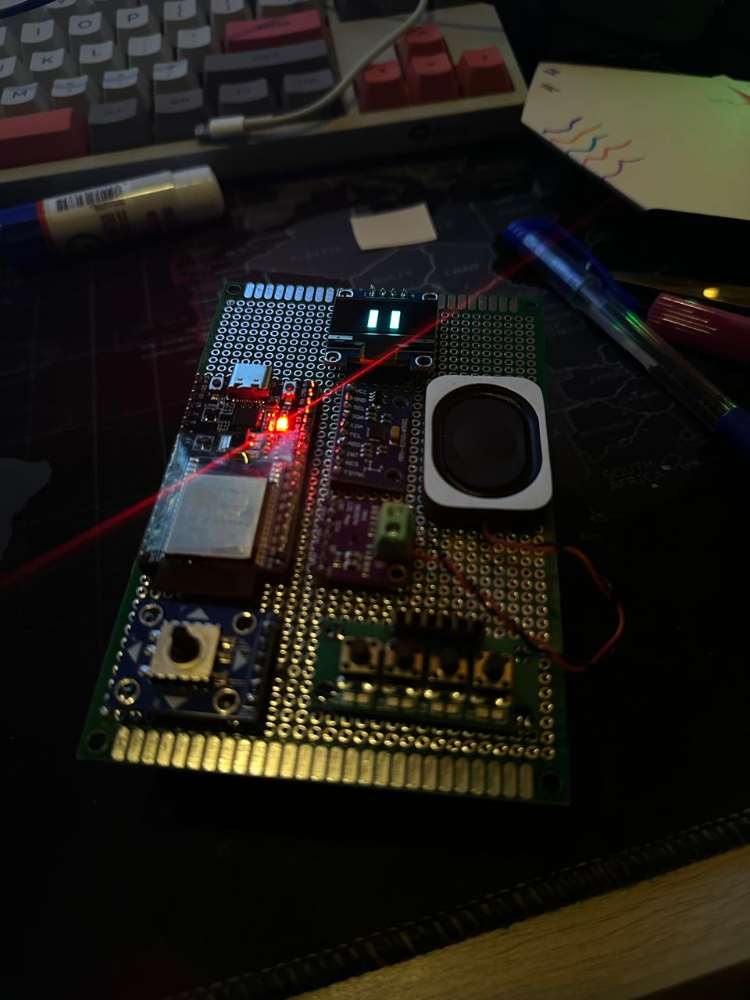
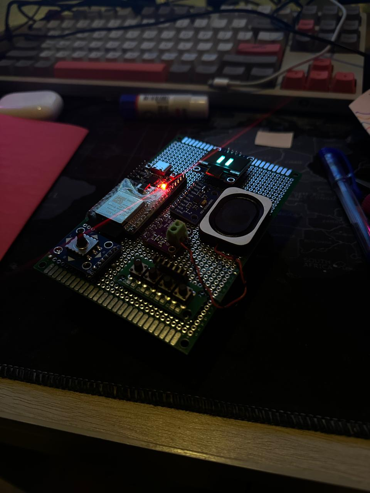

# Interactive Voice & Motion Responsive Mini Robot

A hand-built embedded system powered by an ESP32 microcontroller, featuring voice responses, animated OLED expressions, joystick-controlled "gaze," motion detection, and physical button interactions — all soldered onto a custom prototype PCB and battery-powered.

---

## Demo

> 📸 *(Photos of the board powered on)*




> 🎥 *(Video demo — add link here once uploaded to YouTube/Google Drive)*

---

## Features

| Feature | Description |
|---|---|
| 🔊 Startup greeting | Plays a "Hello" audio message on boot |
| 🕹️ Joystick gaze | Joystick input shifts OLED display expressions to look in the corresponding direction |
| 🔘 4 buttons | Each button triggers a unique voice audio clip and matching OLED facial expression |
| 📳 Shake detection | Gyroscope/accelerometer detects shaking and triggers a reaction |
| 🖥️ OLED display | I2C-driven display renders animated pixel-art expressions |
| 🔋 Battery powered | Runs on 4 AA batteries with onboard power management |

---

## Hardware

| Component | Details |
|---|---|
| Microcontroller | ESP32 |
| Display | OLED (I2C) |
| Motion sensor | MPU-6050 gyroscope/accelerometer (I2C) |
| Audio output | Speaker with onboard audio module |
| Input | 4-button array + analog joystick |
| Power | 4x AA batteries |
| Board | Hand-soldered prototype PCB |

---

## Software

- **Platform:** PlatformIO
- **Language:** C++ (Arduino framework for ESP32)
- **Key libraries:**
  - `U8g2` — OLED display rendering
  - `ESP8266Audio` / `ESP32-audioI2S` — audio playback from flash storage
  - `Wire` — I2C communication for OLED and gyroscope

---

## Project Structure

```
├── src/
│   └── main.cpp          # Main firmware entry point
├── platformio.ini         # PlatformIO build config
└── README.md
```

---

## How It Works

On boot, the robot plays a startup greeting and displays an idle expression on the OLED. From there:

- Moving the **joystick** updates the display expression to "look" in that direction in real time
- Pressing any of the **4 buttons** triggers a pre-recorded voice clip and a corresponding animated face
- If the device is **shaken**, the gyroscope detects the movement and triggers a shake-reaction expression and audio
- All I2C devices (OLED + gyroscope) share the same bus — a key hardware challenge during development was resolving address conflicts and timing issues between simultaneous I2C reads and display updates

---

## Build Highlights

- Fully hand-soldered onto a prototype board — no custom PCB fab
- Bare-metal C++ firmware with no RTOS; all sensor polling and audio scheduling handled in the main loop
- Resolved asynchronous I2C bus conflicts between the OLED and accelerometer during iterative hardware testing
- Power management designed to run stably off AA batteries without voltage regulation issues

---

## Getting Started

### Prerequisites
- [PlatformIO](https://platformio.org/) installed (VS Code extension or CLI)
- ESP32 board support package


---

## Author

**Hammad Ali Ahmad**
[LinkedIn](https://www.linkedin.com/in/hammad-ali-ahmad) · [GitHub](https://github.com/hammadaliahmad)
